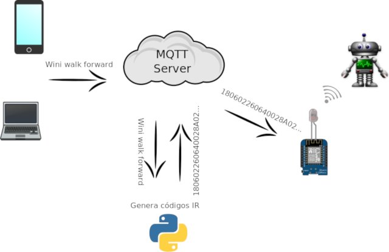
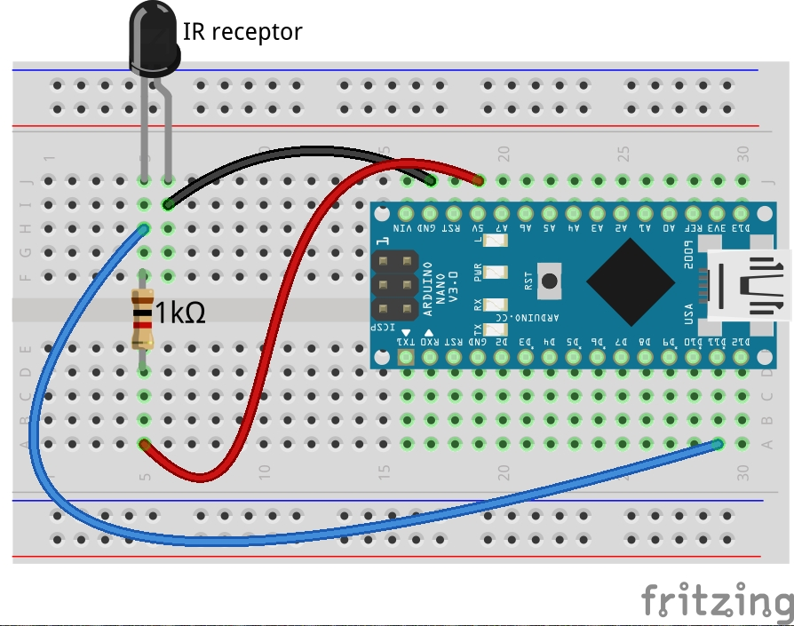
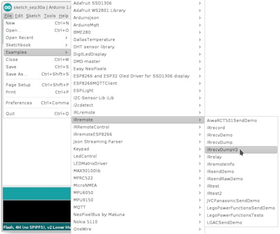
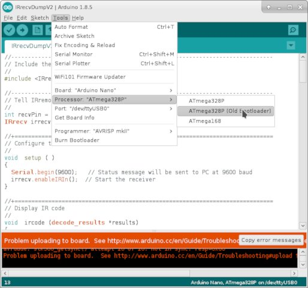
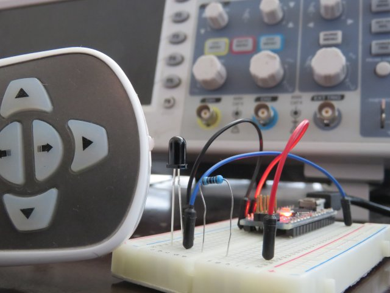
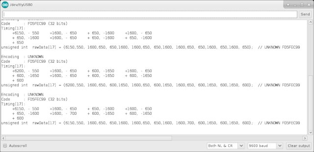
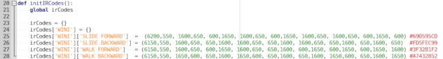
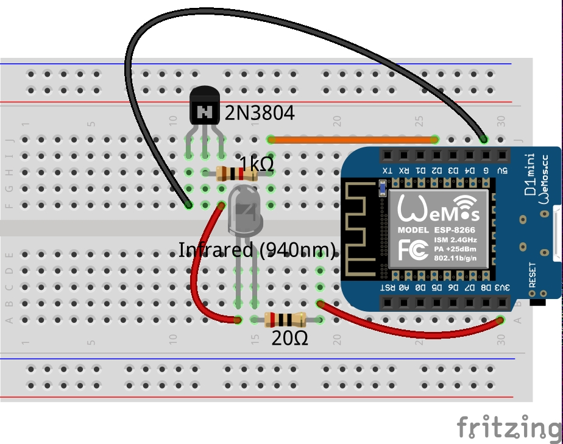
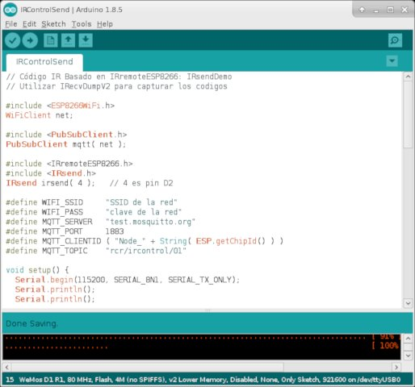

# CadyWixx-Robot
Hacking the Cady chinese robot or any infrared (IR) remote controlled toy

Hackeando el control remoto del robot chino Cady o cualquier otro juguete manipulado con un control remoto infrarojo (IR)

La operación se basa en MQTT como se muestra en la siguiente figura:




## Captura de los códigos del control remoto

1. Montar el circuito lector


2. Cargar el sketch para la captura (requiere instalar la librería IRremote)


3. En el caso del Arduino Nano seleccionar el tipo apropiado


4. Colocar el control remoto cerca del LED


5. Presionar varias veces el botón a capturar hasta ver líneas similares con el mismo comentario ```UNKNOWN xxx```


6. Copiar los datos de esa línea al código del programa que se está construyendo, acorde al lenguaje y la lógica utilizada



## Controlando dispositivos IR con un Wemos D1 R1

1. Montar el circuito emisor


2. Cargar el sketch ```IRControlSend.ino``` en el Wemos D1 R1
Debe modificar el SSID de su red y la clave respectiva. El sketch espera, desde un servidor MQTT, el código que debe enviar vía IR



## Ejecutando el código

El código principal se encuentra en el archivo ```IRControl.py```
